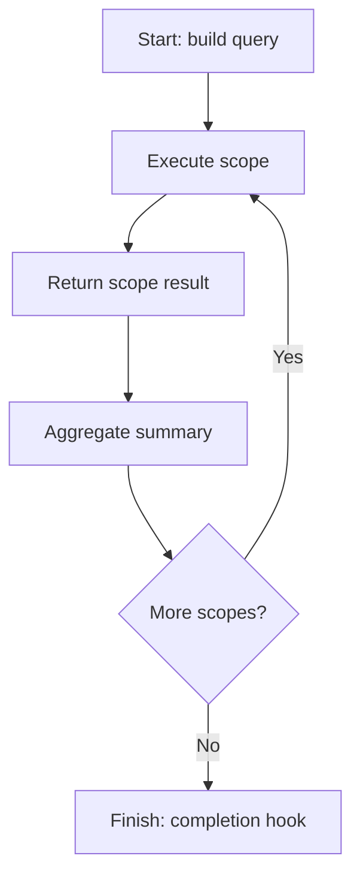

# ApexConvoy Batch Processing Framework

**Reliable, observable and restartable asynchronous processing for Salesforce.**

ApexConvoy is a standalone Salesforce framework for organising large or long-running workloads around explicit job definitions, scope results and execution summaries.

> A batch job is not merely code running later. It is an operational process that must explain what it attempted, what succeeded, what failed and what can safely happen next.

## Status

The v0.1 foundation provides:

- a template-method base class over `Database.Batchable<SObject>`;
- state carried safely between successful scopes with `Database.Stateful`;
- execution and correlation identifiers;
- structured scope results;
- aggregate job summaries;
- final completion hooks;
- an Account normalisation example;
- unit-test foundations.

Durable checkpoints, record-level failure storage, retries, chaining, concurrency control, administration UI and ApexSignal integration are planned extensions. The current release does **not** claim restartability yet.

## Portfolio family

| Project | Responsibility |
|---|---|
| [ApexRail](https://github.com/thegeenana/apexrail-trigger-framework) | Deterministic trigger orchestration |
| [ApexSignal](https://github.com/thegeenana/apexsignal-logging-framework) | Structured logging and operational evidence |
| **ApexConvoy** | Reliable asynchronous workload orchestration |

Each project remains independently deployable. Integrations should use optional adapters rather than circular dependencies.

## Quick start

```apex
public class CloseStaleCasesBatch extends ApexConvoyBatch {
    protected override Database.QueryLocator buildQuery(
        ApexConvoyContext context
    ) {
        return Database.getQueryLocator([
            SELECT Id, Status
            FROM Case
            WHERE Status = 'New'
            AND CreatedDate < LAST_N_DAYS:30
        ]);
    }

    protected override ApexConvoyScopeResult processScope(
        List<SObject> records,
        ApexConvoyContext context
    ) {
        List<Case> casesToClose = (List<Case>) records;
        for (Case item : casesToClose) {
            item.Status = 'Closed';
        }

        Database.SaveResult[] results = Database.update(casesToClose, false);
        return ApexConvoyScopeResult.fromSaveResults(results);
    }

    protected override void onComplete(ApexConvoySummary summary) {
        System.debug('ApexConvoy summary: ' + summary.toJson());
    }
}
```

Run it with normal Salesforce semantics:

```apex
Id asyncJobId = Database.executeBatch(new CloseStaleCasesBatch(), 200);
```

## Lifecycle



See [Architecture](docs/ARCHITECTURE.md), [Roadmap](docs/ROADMAP.md), and [Contributing](CONTRIBUTING.md).

## Design principles

- **Honest execution state** — distinguish attempted, successful and failed records.
- **Idempotency before retry** — repeatable work is an application responsibility.
- **Checkpoints over guesswork** — recovery must know what was durably completed.
- **Bulk processing by default** — framework APIs operate on scopes, never single records.
- **Operational visibility** — execution identity and summaries are first-class.
- **Platform aware** — respect shared asynchronous capacity and governor limits.
- **Standalone core** — no required dependency on ApexSignal or ApexRail.

## Author

Designed and maintained by **George Wiafe**.

## License

MIT — see [LICENSE](LICENSE).
