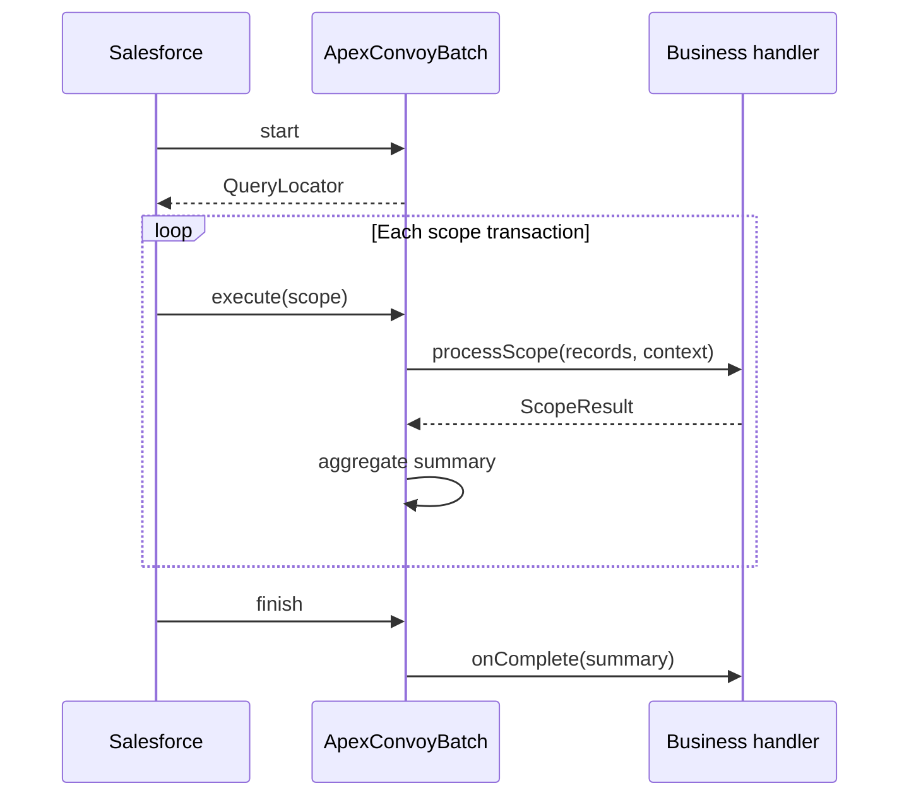

# ApexConvoy architecture

## Purpose

ApexConvoy provides structure around Salesforce asynchronous workloads. The framework separates lifecycle orchestration from business-specific scope processing.

## v0.1 components

| Component | Responsibility |
|---|---|
| `ApexConvoyBatch` | Template lifecycle for start, execute and finish |
| `ApexConvoyContext` | Job, execution, correlation and phase context |
| `ApexConvoyScopeResult` | Outcome of one successfully completed scope transaction |
| `ApexConvoySummary` | Stateful aggregation across successful scopes |
| Example batch | Demonstrates partial-save processing |

## Transaction model

Every `execute` invocation is a separate Salesforce transaction. `Database.Stateful` serializes instance state between successfully completed scopes. It is not a substitute for a durable checkpoint store.

## Failure semantics

If `processScope` throws an exception, that scope transaction rolls back. ApexConvoy does not catch and relabel that failure as success. Because state mutations in the failed transaction also roll back, v0.1 summaries only aggregate scopes that returned a result successfully.

Record-level partial success should use `Database.insert/update/upsert(records, false)` and return `ApexConvoyScopeResult.fromSaveResults(...)`.

## Idempotency

Retries can repeat business effects. ApexConvoy cannot infer idempotency from arbitrary application code. Future retry APIs will require an idempotency key or an explicit policy.

## Extension boundary

ApexSignal integration will be optional. The core must work when ApexSignal is not installed. The same rule applies to ApexRail.
